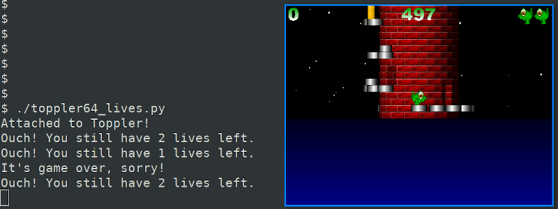
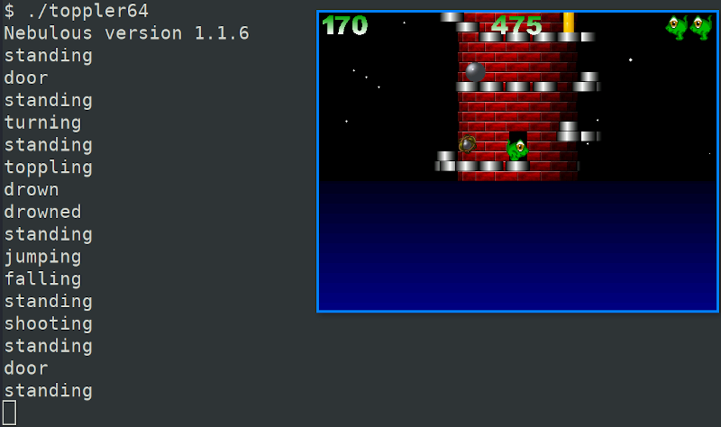

# Dynamic binary instrumentation
In this assignment, you have to instrument the 64-bit version of Toppler (the same game you previously reversed) using both Frida and Intel Pin.
We prepared the "boring" parts for you, so you only need to fill in the *TODO* parts.

## Frida
The file `toppler64_lives.py` is your starting point. You must complete the JavaScript portion (the Python part is already complete) so that, each time the player dies in the game you print to the console, by using `console.log`:
- "Ouch! You still have *n* lives left.", when the player has still *n* lives left, with n>0
- "It's game over, sorry!", if the player has no more lives left.

Please note that the addresses for:
- `PTS_DIED`, the function called when the player dies, and
- `LIVES`, the variable that stores the remaining lives, are already defined.

For instance, by playing the *instrumented* game you should see something like the following:

## Pin
The file `toppler64_state.cpp` is your starting point (use the standard Pin makefiles to compile it).
You must complete such a file to print the name of the player state each time the variable state is written to.
Inside the (incomplete) source file, you'll find `states[]` and `toppler64_state_address` already defined.

For instance, by playing the *instrumented* game you should see something like the following:

